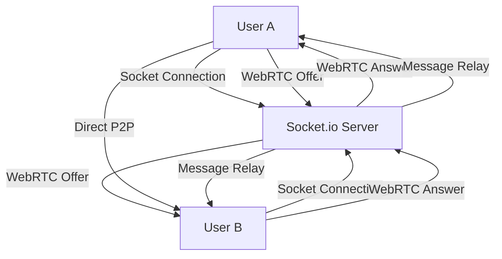

# Chat & Calling Application Implementation Plan

## Executive Summary

This plan outlines the implementation of a full-featured chat and calling application using the existing React/TypeScript frontend and Node.js/Express backend with Socket.io. The system will support real-time messaging, voice and video calling for 1-on-1 conversations, handling 100-500 concurrent users.

## Architecture Overview

### System Components

```
┌─────────────────┐    ┌─────────────────┐    ┌─────────────────┐
│   Frontend      │    │    Backend      │    │   Database      │
│                 │    │                 │    │                 │
│ React + TS      │◄──►│ Express + TS    │◄──►│   MongoDB       │
│ Socket.io Client│    │ Socket.io Server│    │                 │
│ WebRTC Client   │    │ WebRTC Signaling│    │                 │
│ UI Components   │    │ REST API        │    │                 │
└─────────────────┘    └─────────────────┘    └─────────────────┘
         │                       │                       │
         │                       │                       │
         ▼                       ▼                       ▼
┌─────────────────┐    ┌─────────────────┐    ┌─────────────────┐
│  File Storage   │    │  STUN/TURN      │    │   Monitoring    │
│                 │    │                 │    │                 │
│  Cloudinary     │    │  Coturn Server  │    │  Analytics      │
│  (Images/Files) │    │                 │    │  Logging        │
└─────────────────┘    └─────────────────┘    └─────────────────┘
```

### Real-time Communication Flow



## Phase 1: Enhanced Messaging System (Week 1-2)

### 1.1 Complete Missing Socket.io Event Handlers

**Backend Updates (`backend/services/socketService.js`)**:
- Add `user_joined` and `user_left` events
- Implement message delivery status
- Add message edit/delete functionality
- Create typing timeout handling

**Frontend Updates (`src/services/socketService.ts`)**:
- Add event handlers for user presence
- Implement message status callbacks
- Add connection state management

### 1.2 Message Read Receipts & Delivery Status

**Database Schema Updates**:
```javascript
// Add to message schema
deliveryStatus: {
  type: String,
  enum: ['sent', 'delivered', 'read'],
  default: 'sent'
},
deliveredTo: [{
  userId: { type: ObjectId, ref: 'User' },
  deliveredAt: Date
}]
```

### 1.3 User Presence Status

**Implementation**:
- Track user online/offline status
- Show last seen timestamp
- Handle connection state changes

### 1.4 File & Image Sharing

**Backend**:
- Add file upload endpoints
- Integrate with Cloudinary for storage
- File type validation and size limits

**Frontend**:
- Add file picker component
- Image preview before sending
- Progress indicators for uploads

## Phase 2: WebRTC Calling System (Week 3-4)

### 2.1 WebRTC Architecture Design

**Signaling Protocol**:
```javascript
// Call initiation flow
{
  type: 'call_offer',
  from: 'userId',
  to: 'userId',
  callType: 'voice' | 'video',
  offer: RTCSessionDescription
}

// Call response flow
{
  type: 'call_answer',
  from: 'userId',
  to: 'userId',
  answer: RTCSessionDescription
}
```

### 2.2 STUN/TURN Configuration

**Coturn Server Setup**:
```javascript
// backend/config/turn.js
export const turnConfig = {
  iceServers: [
    { urls: 'stun:stun.l.google.com:19302' },
    {
      urls: 'turn:your-turn-server.com:3478',
      username: 'username',
      credential: 'password'
    }
  ]
};
```

### 2.3 WebRTC Service Classes

**Frontend Service (`src/services/webrtcService.ts`)**:
```typescript
class WebRTCService {
  private peerConnection: RTCPeerConnection;
  private localStream: MediaStream;
  private remoteStream: MediaStream;
  
  async initializeCall(callType: 'voice' | 'video'): Promise<void>
  async createOffer(targetUserId: string): Promise<void>
  async handleOffer(offer: RTCSessionDescription): Promise<void>
  async handleAnswer(answer: RTCSessionDescription): Promise<void>
  async addIceCandidate(candidate: RTCIceCandidate): Promise<void>
  async endCall(): Promise<void>
  toggleAudio(): void
  toggleVideo(): void
}
```

**Backend Signaling Service (`backend/services/callService.js`)**:
```javascript
class CallService {
  constructor() {
    this.activeCalls = new Map(); // callId -> call data
    this.userCalls = new Map(); // userId -> callId
  }
  
  createCallOffer(data) // Handle call offers
  handleCallAnswer(data) // Handle call answers
  handleIceCandidate(data) // Handle ICE candidates
  endCall(callId) // End call and cleanup
  getCallHistory(userId) // Retrieve call history
}
```

### 2.4 Call Session Management

**Database Schema**:
```javascript
// Call History Model
const callSchema = new mongoose.Schema({
  participants: [{ type: ObjectId, ref: 'User' }],
  callType: { type: String, enum: ['voice', 'video'] },
  startTime: { type: Date, default: Date.now },
  endTime: Date,
  duration: Number, // in seconds
  quality: {
    avgVideoQuality: String,
    avgAudioQuality: String,
    networkQuality: String
  },
  status: { type: String, enum: ['completed', 'missed', 'declined'] }
});
```

## Phase 3: Call Management System (Week 4-5)

### 3.1 Call Initiation & Permissions

**Frontend Implementation**:
- Check microphone/camera permissions
- Validate user availability
- Show calling interface with ringtone

**Backend Logic**:
- Check if user is available (not in another call)
- Validate user permissions
- Create call session and notify callee

### 3.2 Call Receiving Interface

**UI Components**:
```typescript
// Call notification modal
interface CallNotificationProps {
  incomingCall: {
    callerId: string;
    callerName: string;
    callType: 'voice' | 'video';
  };
  onAnswer: () => void;
  onDecline: () => void;
}
```

### 3.3 Call Controls

**Available Controls**:
- Mute/Unmute audio
- Enable/Disable video
- Switch camera (mobile)
- End call
- Screen sharing (future)

## Phase 4: UI Components & Integration (Week 5-6)

### 4.1 Enhanced Chat Interface

**Component Updates**:
- Add call buttons to chat header
- Show user online status
- Message search functionality
- File attachment interface

### 4.2 Call Interface Components

**Voice Call Component**:
```typescript
interface VoiceCallProps {
  participant: User;
  callState: 'connecting' | 'ringing' | 'connected' | 'ended';
  onEndCall: () => void;
  onToggleMute: () => void;
}
```

**Video Call Component**:
```typescript
interface VideoCallProps {
  participant: User;
  localStream: MediaStream;
  remoteStream: MediaStream;
  callState: CallState;
  onEndCall: () => void;
  onToggleMute: () => void;
  onToggleVideo: () => void;
  onSwitchCamera: () => void;
}
```

### 4.3 Call History Component

**Features**:
- List of previous calls with timestamps
- Call duration and quality info
- Quick callback functionality

## Phase 5: Testing & Optimization (Week 6-7)

### 5.1 Testing Strategy

**Unit Tests**:
- WebRTC service methods
- Socket.io event handling
- Component interactions

**Integration Tests**:
- End-to-end call flow
- Message delivery scenarios
- Network failure handling

**Performance Tests**:
- Load testing with 100-500 concurrent users
- WebRTC connection establishment times
- Message delivery latency

### 5.2 Security Considerations

**Implementation**:
- JWT token validation for all WebRTC signaling
- Call session authentication
- Message encryption at rest
- Rate limiting for API endpoints

## Phase 6: Deployment & Monitoring (Week 7-8)

### 6.1 Production Configuration

**Environment Setup**:
```javascript
// Production environment variables
NODE_ENV=production
PORT=5000
MONGODB_URI=mongodb://production-db:27017/kenya-connect
REDIS_URL=redis://production-redis:6379
TURN_SERVER_URL=turn:your-turn-server.com:3478
TURN_USERNAME=production_user
TURN_PASSWORD=production_password
```

### 6.2 Load Balancing

**Socket.io Clustering**:
```javascript
// Redis adapter for Socket.io
import { createAdapter } from '@socket.io/redis-adapter';
const { createClient } = require('redis');

const pubClient = createClient({ url: process.env.REDIS_URL });
const subClient = pubClient.duplicate();

io.adapter(createAdapter(pubClient, subClient));
```

### 6.3 Monitoring & Analytics

**Metrics to Track**:
- Active call sessions
- WebRTC connection success rates
- Message delivery times
- User engagement statistics
- Error rates and types

## Technical Implementation Details

### Database Optimization

**Indexes**:
```javascript
// Chat collection indexes
db.chats.createIndex({ "participants": 1 });
db.chats.createIndex({ "lastMessageAt": -1 });
db.messages.createIndex({ "chatId": 1, "timestamp": -1 });
db.calls.createIndex({ "participants": 1 });
db.calls.createIndex({ "startTime": -1 });
```

**Aggregation for Chat List**:
```javascript
const chats = await Chat.aggregate([
  { $match: { participants: userId, isActive: true } },
  { $unwind: "$messages" },
  { $sort: { "messages.timestamp": -1 } },
  { $group: {
    _id: "$_id",
    participants: { $first: "$participants" },
    lastMessage: { $first: "$messages" },
    lastMessageAt: { $first: "$lastMessageAt" }
  }},
  { $sort: { lastMessageAt: -1 } }
]);
```

### WebRTC Connection Handling

**Connection States**:
```typescript
enum ConnectionState {
  NEW = 'new',
  CONNECTING = 'connecting',
  CONNECTED = 'connected',
  RECONNECTING = 'reconnecting',
  DISCONNECTED = 'disconnected',
  FAILED = 'failed',
  CLOSED = 'closed'
}
```

**Network Adaptation**:
```typescript
class NetworkAdaptation {
  private stats: RTCStatsReport;
  
  async monitorConnection(): Promise<void> {
    setInterval(async () => {
      const stats = await this.peerConnection.getStats();
      this.analyzeNetworkQuality(stats);
      this.adaptQuality();
    }, 5000);
  }
  
  private analyzeNetworkQuality(stats: RTCStatsReport): void {
    // Analyze bandwidth, packet loss, latency
    // Adjust video quality accordingly
  }
}
```

### Error Handling & Recovery

**Reconnection Logic**:
```typescript
class ConnectionManager {
  private maxReconnectAttempts = 5;
  private reconnectInterval = 2000;
  
  async handleDisconnect(): Promise<void> {
    let attempts = 0;
    while (attempts < this.maxReconnectAttempts) {
      try {
        await this.reconnect();
        break;
      } catch (error) {
        attempts++;
        await this.delay(this.reconnectInterval * attempts);
      }
    }
  }
}
```

## Security Implementation

### Authentication & Authorization

**JWT Validation Middleware**:
```javascript
const validateWebRTCAuth = (socket, next) => {
  const token = socket.handshake.auth.token;
  try {
    const decoded = jwt.verify(token, process.env.JWT_SECRET);
    socket.userId = decoded.id;
    next();
  } catch (error) {
    next(new Error('Authentication failed'));
  }
};
```

### Message Security

**Encryption at Rest**:
```javascript
// Mongoose encryption plugin for sensitive data
import mongooseEncryption from 'mongoose-encryption';

const messageSchema = new mongoose.Schema({
  // ... fields
});

messageSchema.plugin(mongooseEncryption, {
  secret: process.env.MONGODB_ENCRYPTION_KEY,
  encryptedFields: ['content']
});
```

## Performance Optimization

### Frontend Optimization

**Virtual Scrolling for Messages**:
```typescript
import { FixedSizeList as List } from 'react-window';

const VirtualizedMessageList = ({ messages }) => (
  <List
    height={600}
    itemCount={messages.length}
    itemSize={80}
    itemData={messages}
  >
    {MessageItem}
  </List>
);
```

**Lazy Loading**:
```typescript
const CallInterface = lazy(() => import('./components/CallInterface'));
const ChatHistory = lazy(() => import('./components/ChatHistory'));
```

### Backend Optimization

**Connection Pooling**:
```javascript
// MongoDB connection with pooling
mongoose.connect(process.env.MONGODB_URI, {
  maxPoolSize: 10,
  serverSelectionTimeoutMS: 5000,
  socketTimeoutMS: 45000,
});
```

**Caching Strategy**:
```javascript
// Redis caching for frequently accessed data
import redis from 'redis';
const client = redis.createClient();

const getUserChats = async (userId) => {
  const cacheKey = `chats:${userId}`;
  const cached = await client.get(cacheKey);
  
  if (cached) {
    return JSON.parse(cached);
  }
  
  const chats = await Chat.find({ participants: userId });
  await client.setex(cacheKey, 300, JSON.stringify(chats));
  return chats;
};
```

## Development Timeline

| Week | Phase | Deliverables |
|------|-------|--------------|
| 1-2 | Foundation | Enhanced messaging, presence, file sharing |
| 3-4 | WebRTC Setup | Signaling, STUN/TURN, basic calling |
| 4-5 | Call Management | Full call flow, UI components |
| 5-6 | Integration | UI polish, call history, notifications |
| 6-7 | Testing | Comprehensive testing, optimization |
| 7-8 | Deployment | Production setup, monitoring, docs |

## Success Metrics

### Technical KPIs
- Message delivery time < 100ms
- Call connection time < 3 seconds
- WebRTC connection success rate > 95%
- Support for 500 concurrent users
- System uptime > 99.9%

### User Experience KPIs
- Call quality rating > 4.0/5.0
- Message read rate > 90%
- User retention rate > 80%
- Feature adoption rate > 60%

## Risk Mitigation

### Technical Risks
1. **WebRTC NAT Traversal Issues**: Comprehensive STUN/TURN setup
2. **Scalability Concerns**: Load testing and optimization
3. **Browser Compatibility**: Progressive enhancement strategy
4. **Network Quality Variations**: Adaptive bitrate streaming

### Operational Risks
1. **Server Resource Usage**: Monitoring and auto-scaling
2. **Database Performance**: Indexing and query optimization
3. **Security Vulnerabilities**: Regular security audits
4. **User Experience Issues**: A/B testing and user feedback

This comprehensive plan provides a structured approach to building your chat and calling application with clear phases, technical specifications, and success metrics. Each phase builds upon the previous one, ensuring a solid foundation and gradual feature addition.